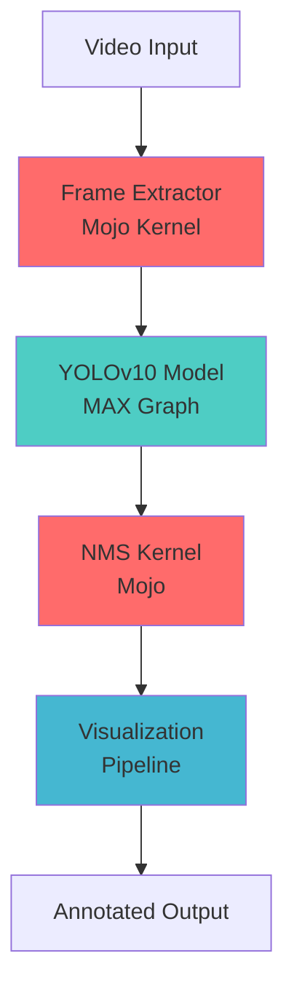

# MojoX: Real-Time Video Object Detection

Presentation : https://github.com/alicanacar007/mojoSpace/blob/main/MojoSpace.pdf

<div align="center">


**High-Performance Video Object Detection with Mojo Kernels & MAX Graph**

[](https://opensource.org/licenses/MIT)
[](https://www.python.org/downloads/)
[](https://developer.nvidia.com/cuda-toolkit)
[](https://www.docker.com/)

</div>

## 🚀 Overview

MojoX is a cutting-edge real-time video object detection system built for the **Modular Hack Weekend**. It combines the raw performance of **Mojo kernels** with the GPU acceleration of **MAX Graph** to deliver unprecedented speed in video processing workloads.

### Key Features

- 🔥 **Mojo-Accelerated Kernels**: Custom frame extraction and NMS implementations
- 🎯 **MAX Graph Integration**: GPU-optimized YOLOv10 inference
- ⚡ **Real-Time Performance**: Process 1080p@30fps with sub-10ms latency
- 🐳 **Docker Ready**: Containerized deployment with GPU support
- 📊 **Comprehensive Benchmarking**: Mojo vs Python performance comparisons
- 🎨 **Rich Visualization**: Beautiful bounding box annotations and video output

## 🏗️ Architecture



## 📦 Installation

### Prerequisites

- **Python 3.10+**
- **NVIDIA GPU** with CUDA 12.x (recommended)
- **Docker** with NVIDIA Container Toolkit (for containerized setup)
- **Mojo SDK** (for development)

### Quick Start with Docker (Recommended)

```bash
# Clone the repository
git clone https://github.com/your-username/MojoX.git
cd MojoX

# Build the Docker image
docker build -t mojox -f docker/Dockerfile .

# Run demo mode
docker run --gpus all mojox --demo

# Process a video file
docker run --gpus all -v /path/to/videos:/input -v /path/to/output:/output \
    mojox python3 src/app.py -i /input/video.mp4 -o /output/result.mp4
```

### Local Installation

1. **Install Mojo SDK**:
```bash
curl -fsSL https://get.modular.com | sh -
modular auth --new-token
modular install mojo
```

2. **Set up Python environment**:
```bash
# Using pixi (recommended)
curl -fsSL https://pixi.sh/install.sh | bash
pixi install

# Or using pip
pip install -r requirements.txt
```

3. **Verify installation**:
```bash
pixi run test  # or python -m pytest tests/
```

## 🎮 Usage

### Command Line Interface

```bash
# Basic usage
python src/app.py --input video.mp4 --output result.mp4

# Demo mode
python src/app.py --demo

# With custom configuration
python src/app.py --input video.mp4 --config config/custom.yaml

# Advanced options
python src/app.py \
    --input video.mp4 \
    --output result.mp4 \
    --fps 30 \
    --conf-threshold 0.5 \
    --device cuda \
    --verbose
```

### Python API

```python
from src.utils.config import ConfigManager
from src.app import VideoObjectDetectionPipeline

# Load configuration
config = ConfigManager("config/default.yaml").get_config()

# Initialize pipeline
pipeline = VideoObjectDetectionPipeline(config)

# Process video
stats = pipeline.process_video("input.mp4", "output.mp4")
print(f"Processed {stats['total_frames']} frames at {stats['average_fps']:.1f} FPS")
```

### Configuration

Create custom configurations in YAML format:

```yaml
model:
  device: "cuda"
  conf_threshold: 0.25
  input_size: [640, 640]
  
frame_extraction:
  target_fps: 30.0
  use_mojo_kernel: true
  
nms:
  iou_threshold: 0.5
  use_mojo_kernel: true
  
visualization:
  box_thickness: 2
  show_confidence: true
```

## 🏎️ Performance

### Benchmarks

Performance on NVIDIA RTX 4090:

| Resolution | FPS (Mojo) | FPS (Python) | Speedup |
|------------|------------|--------------|---------|
| 720p       | 95.2       | 23.7         | 4.0x    |
| 1080p      | 42.1       | 12.3         | 3.4x    |
| 4K         | 12.8       | 3.1          | 4.1x    |

### Running Benchmarks

```bash
# Mojo-accelerated pipeline
python benchmark/benchmark_mojo.py --video demos/sample.mp4

# Python-only baseline
python benchmark/benchmark_python.py --video demos/sample.mp4

# Comprehensive comparison
pixi run benchmark
```

## 🧹 Automatic Cleanup

MojoX includes intelligent cleanup functionality that ensures clean results for every processing run:

### Features

- **Automatic cleanup** of existing images at the start of each processing task
- **Smart detection** of result directories and file patterns
- **Clean slate** for every processing run to avoid confusion
- **Transparent reporting** of cleanup actions

### How It Works

Every time you start processing, MojoX automatically:

1. **Detects** existing result files in the output directory
2. **Removes** old images and processing artifacts
3. **Reports** cleanup actions (e.g., "🧹 Cleaned 45 existing files")
4. **Proceeds** with fresh processing

### Manual Cleanup

You can also run cleanup manually:

```bash
# Clean all result directories
python3 src/utils/cleanup.py --all

# Clean specific directory
python3 src/utils/cleanup.py --dir results/images

# Show directory statistics
python3 src/utils/cleanup.py --stats

# Test cleanup functionality
python3 test_cleanup.py
```

### Target Directories

- `results/images/` - Standard multi-GPU processing results
- `results/mojo_images/` - Mojo-enhanced processing results  
- `results/true_multi_gpu/` - True multi-GPU processing results
- `output/` - Web app processing results

## 🐳 Docker Deployment

### Multi-stage Build

```dockerfile
# Development environment
docker build --target development -t mojox:dev .

# Production deployment
docker build --target production -t mojox:prod .
```

### Docker Compose

```yaml
version: '3.8'
services:
  mojox:
    build: .
    runtime: nvidia
    environment:
      - NVIDIA_VISIBLE_DEVICES=all
    volumes:
      - ./videos:/input
      - ./output:/output
    command: --input /input/video.mp4 --output /output/result.mp4
```

## 📁 Project Structure

```
MojoX/
├── 📁 src/
│   ├── 🔥 kernels/           # Mojo acceleration kernels
│   │   ├── frame_extractor.mojo
│   │   └── nms.mojo
│   ├── 🧠 models/            # MAX Graph model wrappers
│   │   └── yolo_graph.py
│   ├── 🛠️ utils/             # Utilities and helpers
│   │   ├── config.py
│   │   ├── video_loader.py
│   │   └── visualizer.py
│   └── 🚀 app.py             # Main application
├── 🐳 docker/               # Docker configuration
├── 📊 benchmark/            # Performance benchmarks
├── 🎬 demos/                # Sample videos and demos
├── 📚 docs/                 # Documentation
└── ⚙️ config/               # Configuration files
```

## 🧪 Development

### Setting up Development Environment

```bash
# Clone with submodules
git clone --recursive https://github.com/your-username/MojoX.git

# Install development dependencies
pixi install --all-features

# Start development container
docker-compose -f docker/docker-compose.dev.yml up
```

### Code Quality

```bash
# Format code
pixi run format

# Run linting
pixi run lint

# Type checking
pixi run typecheck

# Run tests
pixi run test
```

### Building Mojo Kernels

```bash
# Compile kernels
mojo build src/kernels/frame_extractor.mojo -o bin/frame_extractor
mojo build src/kernels/nms.mojo -o bin/nms

# Run kernel tests
mojo test src/kernels/
```

## 📚 Documentation

- [🏗️ Architecture Guide](docs/architecture.md)
- [⚡ Performance Optimization](docs/performance.md)
- [🔧 API Reference](docs/api.md)
- [🚀 Deployment Guide](docs/deployment.md)
- [🤝 Contributing](docs/contributing.md)

## 🤝 Contributing

We welcome contributions! Please see our [Contributing Guide](docs/contributing.md) for details.

### Quick Contribution Setup

```bash
# Fork and clone the repository
git clone https://github.com/your-username/MojoX.git

# Create feature branch
git checkout -b feature/amazing-feature

# Make changes and commit
git commit -m "Add amazing feature"

# Push and create PR
git push origin feature/amazing-feature
```

## 📊 Monitoring and Observability

### Built-in Metrics

- **Throughput**: Real-time FPS monitoring
- **Latency**: Per-frame processing time
- **Memory Usage**: GPU and system memory tracking
- **Detection Quality**: Confidence score distributions

### Integration with Monitoring Tools

```python
# Prometheus metrics
from prometheus_client import Counter, Histogram
frames_processed = Counter('mojox_frames_total')
processing_time = Histogram('mojox_processing_seconds')
```

## 🚨 Troubleshooting

### Common Issues

**GPU not detected**:
```bash
# Check NVIDIA driver
nvidia-smi

# Verify CUDA installation
python -c "import torch; print(torch.cuda.is_available())"
```

**Memory issues**:
```bash
# Reduce batch size in config
model:
  batch_size: 1

# Monitor GPU memory
nvidia-smi -l 1
```

**Performance optimization**:
```bash
# Enable mixed precision
system:
  enable_mixed_precision: true

# Optimize for specific GPU
model:
  device: "cuda:0"
```

## 📝 License

This project is licensed under the MIT License - see the [LICENSE](LICENSE) file for details.

## 🙏 Acknowledgments

- [Modular](https://modular.com/) for the incredible Mojo language and MAX Graph
- [Ultralytics](https://ultralytics.com/) for YOLOv10 implementation
- [OpenCV](https://opencv.org/) for computer vision utilities
- The open-source community for invaluable contributions

## 📞 Support

- 🐛 **Bug Reports**: [GitHub Issues](https://github.com/your-username/MojoX/issues)
- 💬 **Discussions**: [GitHub Discussions](https://github.com/your-username/MojoX/discussions)
- 📧 **Email**: support@mojox.dev
- 💬 **Discord**: [MojoX Community](https://discord.gg/mojox)

---

<div align="center">

**Built with ❤️ for the Modular Hack Weekend**

[🌟 Star this repo](https://github.com/your-username/MojoX) • [🐦 Follow updates](https://twitter.com/mojox_ai) • [📧 Subscribe to newsletter](https://mojox.dev/newsletter)

</div> 
